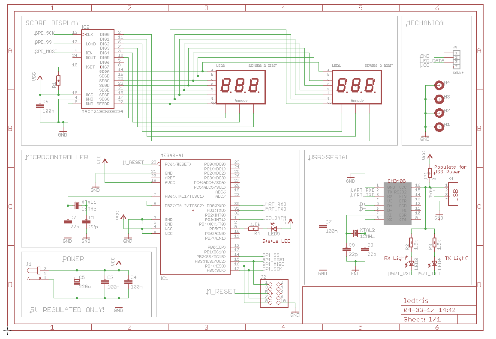

These are instructions for making a LED display driver for Ledtris using the ATMega8A microcontroller.

# Schematics


# Building and uploading
Install the following packages using your favorite package manager.
 * `avr-gcc` - AVR GNU C compiler
 * `avr-libc` - AVR Standard C Library
 * `avrdude` - Driver program for "simple" Atmel AVR MCU programmer

The makefile has targets for programming the
fuse bits and the flash memory. The fuse bits have to be programmed once to set up the oscillator.
 1. To build simply run `make`
 2. Program the fuse bits using `make fuses`
 3. Then program the flash using `make flash`

>This AVR firmware has been tested with an ATMega8A microcontroller.
>If you wish to use a different microcontroller, please change the following lines of the 
>Makefile.
>```
>    DEVICE = atmega8
>    AVRDUDE_DEV = m8
>```
>Both DEVICE and AVRDUDE_DEV need to be changed if you are using a different microcontroller.
> * DEVICE is passed to `avr-gcc` using the `-mmcu` option.
> * AVRDUDE_DEV is passed to `avrdude` using the `-p` option.
>
>If you wish to use a programmer other than usbasp, please change the following line in of the Makefile.
>```
>    AVRDUDE_TOOL = usbasp
>```

# Troubleshooting
If you get the following error while programming the fuses or flash memory
```
avrdude: Warning: cannot open USB device: Permission denied
```
try creating a new udev rule for /etc/udev/rules.d/99-USBasp.rules
```
SUBSYSTEM=="usb", ATTR{product}=="USBasp", ATTR{idProduct}=="05dc", ATTRS{idVendor}=="16c0", MODE="0666"
```