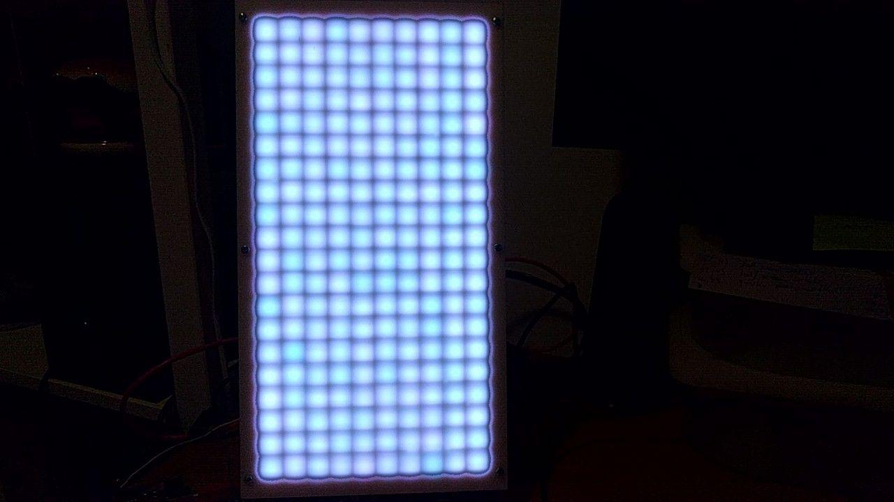
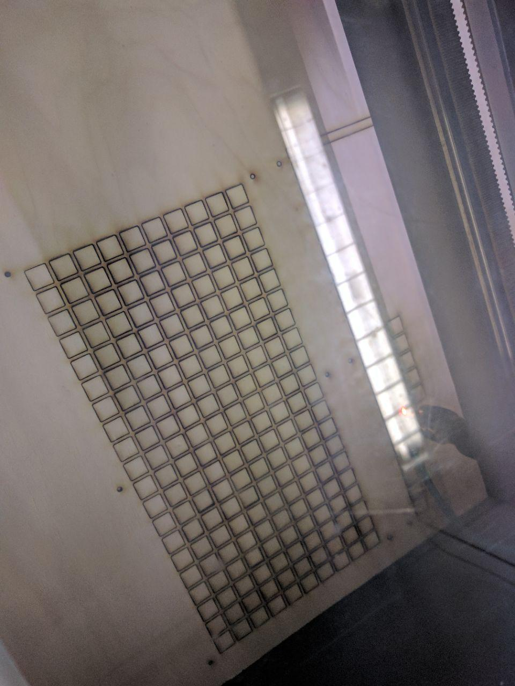
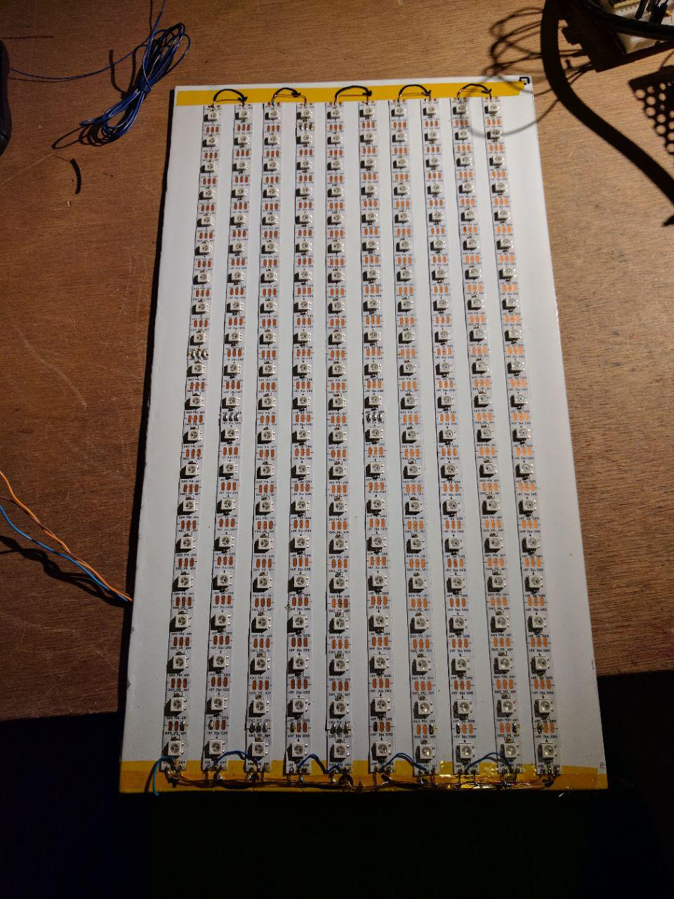

# LED Matrix Display using WS2812B
This is a guide for building an LED matrix display using the popular WS2812B LED strips.

# Parts
See the drawings for dimensions. The following parts are required:
- WS2812B self-adhesive LED strip (300 LED / 5M)
- M3 bolts and nuts (6x)
- 4mm birch plywood sheet
- 2mm white cast acrylic sheet
- 2mm painted aluminium sheet
- 5mm / 24 AWG solid copper wire

# Construction
The display consists of 3 sub assemblies: A painted aluminium plate with the LED strips, a light barrier and a light diffuser. Please refer to the drawings.

## Aluminium Plate + LED Strips
The LED strips are secured to an aluminium plate. It doubles as a heat spreader. Make sure to paint the surface before applying the LED strips, since there are copper contacts on the back. I lightly sanded the surface and applied a single coat of white radiator paint.

The LED strips are placed in a zig-zag pattern so the data-out can feed into the data-in pin of the next strip without running long wires across the display. I had to account for this in software.

## Light Barrier
This part makes the pixels look nice and square. The light barrier should be made out of an opaque material. I used 4mm birch plywood. The barrier consists of two halves. The pieces are almost identical, except the bottom piece has some room for cable management.

## Light Diffuser
The diffuser should be made using a semi-transparent plastic. I used 2mm white polycarbonate. Make sure your plastic can be used with a lasercutter.

# Wiring
Wire the LED strip power rails in parallel on the bottom of the display ( the bottom diffuser has a cutout to accommodate for this! ) The power rails of the LEDS are wired in parallel to reduce voltage drop across the strips. Wire the data out to the next strip's data in pin creating a zig-zag pattern starting from the bottom left. You can leave the data-out pin of the last strip unconnected. Attach a wire to the data-in pin of the first led-strip. This will later be used to drive the display. Attach a wire for 5 V and gnd for the power supply.

Be careful when soldering to the led strips on top of the painted aluminium. If the paint melts the copper contact will short out trough the aluminium. I placed kapton tape below the strips at the ends to prevent this.

# Final Assembly
Stack the layers on top of eachother and secure them in place using M3 bolts.

# Software Used
I used LibreCAD to make the dxf drawings. It is available at http://librecad.org/cms/home.html “LibreCAD Website”

# Contact
If you have any questions regarding this guide please contact me:
Koen van Vliet <8by8mail@gmail.com>
